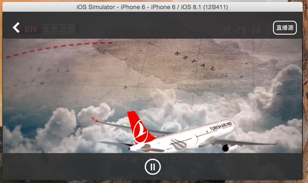

BalabalaTV-iOS
=================
黄盼青-大作业  学号:yxb144325002
---------------------

这是一个基于VLC的iOS网络电视直播软件。

####开发环境

* Xcode6.1
* iOS SDK 8.1
* Cocoapods


####如何在Mac上构建此项目
由于使用了MobileVLCKit，该框架有500M左右（压缩后有180M），无法放到Github上，
因此请在打包下载源代码后，打开控制台，执行以下命令，脚本会自动下载缺失的文件。

```bash
bash ./bootstrap.sh
```

####截图



